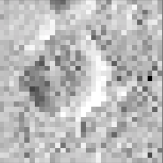
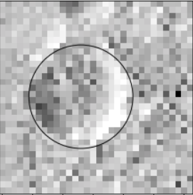

# CRATERFIND (In Development)

This is a prototype application for AI-assisted "one-click" crater annotation by human annotators.

## Overview

CRATERFIND uses a neural network model to locate a crater given a rough crater location and an input image. This information is provided by an annotator with a single click. Note that the proposed crater center is provided to the model implicitly (the center of the input image). <br><br>
The model takes an array of 32x32 pixels and returns three values, a 3-point representation of a circle (x,y,r). Below is an example input and the output is overlaid on the input image.




## Purpose of This Repository

Much work is being done on solving this problem, but CRATERFIND works on the specific problem of integrating this technology with existing user interfaces.<br><br>
Specifically, this repository provides documentation for the API which can be deployed locally using docker. A python demonstration of using the API is provided in the [demo notebook](API_demo.ipynb).

## Installation
This can be run as a RESTful service on the local system using docker; the only dependency is docker (installation for [ubuntu](https://docs.docker.com/install/linux/docker-ce/ubuntu/), [Mac](https://docs.docker.com/docker-for-mac/install/), [Windows](https://docs.docker.com/docker-for-windows/install/)).<br><br>
Launch the service (listening on port `8501`) with:

```
docker run -p 8501:8501 alliedtoasters/craterfind
```
With the container running you can test the API with the following curl command:
```
curl -d '{"instances": [[71, 69, 101, 149, 185, 171, 77, 134, 189, 154, 111, 114, 126, 121, 110, 103, 100, 115, 112, 106, 112, 99, 125, 125, 126, 125, 97, 132, 134, 115, 99, 144, 51, 75, 108, 174, 160, 122, 100, 151, 143, 114, 110, 93, 125, 117, 114, 107, 104, 86, 117, 112, 104, 108, 136, 122, 107, 104, 111, 136, 108, 88, 117, 114, 69, 103, 144, 137, 136, 126, 129, 125, 144, 166, 133, 122, 110, 127, 132, 125, 126, 81, 111, 73, 95, 104, 104, 104, 127, 114, 127, 132, 101, 103, 85, 100, 108, 86, 97, 93, 123, 159, 132, 93, 148, 163, 141, 137, 110, 112, 134, 148, 112, 112, 104, 90, 110, 115, 101, 104, 93, 108, 92, 107, 123, 134, 132, 90, 90, 106, 140, 130, 127, 162, 130, 103, 121, 154, 132, 163, 165, 147, 123, 112, 100, 78, 100, 107, 74, 104, 132, 106, 101, 104, 136, 112, 130, 114, 93, 88, 127, 108, 119, 133, 112, 159, 103, 141, 166, 163, 136, 127, 165, 148, 154, 89, 85, 41, 75, 80, 103, 127, 112, 140, 108, 132, 121, 112, 110, 107, 111, 86, 138, 121, 115, 130, 137, 162, 151, 101, 122, 133, 121, 92, 114, 122, 148, 149, 149, 85, 69, 82, 101, 115, 90, 110, 122, 132, 89, 111, 110, 125, 129, 152, 178, 178, 132, 145, 163, 138, 171, 180, 70, 26, 19, 43, 38, 108, 123, 69, 141, 143, 101, 88, 73, 80, 84, 115, 97, 112, 96, 96, 104, 119, 130, 145, 170, 167, 167, 103, 177, 126, 69, 27, 38, 0, 16, 12, 44, 0, 70, 123, 143, 144, 170, 114, 63, 51, 81, 111, 132, 156, 107, 121, 95, 104, 140, 133, 184, 167, 133, 152, 167, 111, 30, 1, 0, 26, 10, 22, 0, 12, 88, 156, 162, 144, 204, 132, 81, 60, 77, 106, 107, 144, 82, 126, 112, 136, 163, 167, 182, 170, 217, 154, 7, 26, 0, 0, 0, 53, 40, 14, 0, 58, 89, 100, 84, 123, 163, 188, 136, 53, 103, 99, 111, 130, 84, 144, 133, 85, 130, 74, 169, 211, 173, 141, 0, 0, 0, 5, 0, 78, 21, 27, 4, 44, 119, 88, 77, 148, 155, 221, 197, 97, 82, 103, 99, 107, 106, 133, 138, 89, 154, 106, 145, 204, 178, 69, 0, 0, 0, 0, 34, 104, 40, 56, 21, 78, 77, 86, 88, 130, 175, 195, 222, 156, 89, 92, 77, 111, 101, 133, 132, 101, 159, 108, 165, 165, 188, 0, 0, 0, 0, 0, 37, 63, 21, 62, 55, 78, 88, 90, 111, 173, 170, 178, 189, 239, 132, 67, 101, 99, 136, 115, 133, 134, 147, 154, 186, 191, 127, 0, 0, 3, 0, 15, 34, 0, 15, 53, 80, 81, 92, 129, 103, 122, 114, 171, 189, 208, 129, 90, 107, 92, 101, 112, 104, 133, 106, 58, 170, 170, 10, 0, 0, 0, 0, 0, 5, 21, 58, 96, 78, 111, 84, 115, 129, 145, 145, 166, 192, 203, 175, 149, 89, 85, 73, 103, 96, 129, 14, 63, 177, 112, 7, 0, 0, 0, 0, 0, 33, 66, 77, 115, 80, 93, 118, 119, 126, 140, 145, 174, 199, 254, 186, 119, 104, 90, 88, 71, 100, 84, 74, 106, 145, 123, 63, 0, 0, 0, 0, 23, 26, 34, 84, 85, 110, 97, 134, 152, 138, 159, 169, 180, 212, 225, 193, 134, 99, 114, 60, 93, 101, 138, 114, 103, 159, 169, 106, 0, 0, 0, 30, 25, 73, 78, 114, 126, 85, 117, 114, 115, 174, 181, 175, 182, 178, 211, 136, 97, 70, 81, 96, 101, 117, 95, 122, 97, 156, 154, 127, 53, 0, 0, 23, 44, 59, 92, 115, 127, 103, 125, 106, 147, 126, 184, 182, 181, 244, 229, 99, 62, 107, 101, 99, 103, 115, 92, 85, 97, 147, 171, 144, 125, 26, 0, 30, 53, 103, 100, 127, 99, 133, 160, 148, 144, 165, 195, 169, 208, 248, 144, 47, 86, 130, 114, 107, 121, 132, 132, 112, 90, 193, 197, 170, 132, 93, 18, 48, 56, 67, 97, 101, 137, 132, 155, 169, 182, 169, 207, 217, 239, 186, 78, 88, 132, 129, 100, 101, 99, 101, 108, 136, 127, 145, 151, 144, 141, 90, 130, 3, 59, 73, 99, 118, 137, 158, 138, 195, 178, 182, 247, 255, 178, 96, 41, 77, 112, 82, 100, 81, 103, 92, 101, 114, 118, 148, 110, 112, 64, 103, 144, 156, 104, 10, 111, 160, 166, 173, 210, 181, 192, 174, 212, 173, 117, 66, 74, 59, 82, 108, 103, 125, 127, 118, 69, 129, 86, 147, 107, 69, 103, 182, 173, 193, 121, 175, 121, 159, 229, 222, 185, 156, 115, 138, 100, 137, 85, 59, 77, 85, 71, 123, 103, 121, 126, 104, 117, 136, 104, 103, 77, 99, 137, 166, 186, 175, 196, 185, 106, 111, 225, 154, 117, 96, 77, 55, 64, 111, 93, 81, 43, 56, 92, 100, 123, 112, 125, 119, 95, 101, 84, 107, 89, 122, 141, 163, 212, 158, 129, 154, 118, 18, 40, 49, 69, 96, 81, 69, 74, 108, 117, 100, 84, 75, 88, 103, 101, 104, 95, 100, 117, 106, 118, 104, 117, 140, 144, 141, 181, 147, 90, 93, 103, 40, 60, 101, 111, 112, 104, 45, 114, 118, 78, 49, 103, 108, 88, 118, 108, 100, 115, 133, 130, 115, 117, 108, 151, 160, 112, 162, 175, 132, 103, 89, 125, 78, 26, 126, 117, 95, 110, 101, 86, 119, 117, 114, 110, 118, 117, 92, 106, 103, 111, 129, 130, 126, 136, 117, 156, 95, 134, 132, 152, 96, 95, 71, 97, 101, 70, 129, 125, 80, 111, 93, 90, 103, 112, 154, 103, 140, 86, 100, 118, 101, 140, 130, 156, 129, 134, 114, 107, 75, 137, 99, 121, 129, 93, 115, 82, 104, 92, 114, 108, 71, 86, 121, 114, 121, 140, 143, 141, 162, 78, 38, 112, 99, 169, 118, 97, 134, 119, 103, 111, 111, 134, 110, 130, 143, 73, 93, 106, 95, 114, 95, 110, 122, 119, 123, 119, 110, 104, 154, 166, 156, 78, 37, 104, 137, 186, 147, 96, 137, 121]]}' -X POST http://localhost:8501/v1/models/craters:predict
```
You can also test it on images using the [demo notebook](API_demo.ipynb); running this notebook requires `jupyter`, as well as the libraries in [requirements.txt](./requirements.txt).
